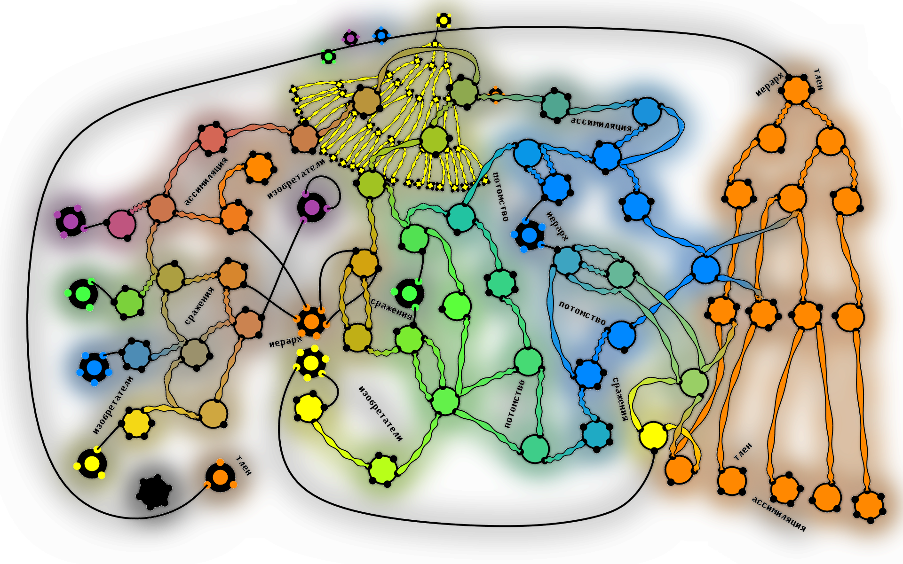

# QapSerialize

# Design surprises

* Reflection objects are serialized through reflection.
* The save-time type system is itself serializable.
* Runtime type descriptors are reconstructed from save-time declarations.
* Loading happens in multiple graph-building stages.
* Type migration is driven by structural metadata.
* Reflection graphs contain cycles.
* Every pointer category has its own reflected descriptor.

---
# Why?

Serialization formats usually assume the loader already knows every type.

QapSerialize treats type information as data.

The type system itself becomes part of the serialized state.

This makes it possible to reason about old save files using the information contained inside them.

---

# The core idea

A save file contains several layers.

```
Save file
│
├── ...
|
├── Save-time type model
│
├── ...
│
├── Type of root object 
│
└── Root object // user data
```

Loading starts from the top.

Each layer enables the next one.

---

# Two reflection worlds

Internally the project works with two completely different reflection systems.

## Runtime reflection

Describes actual C++ types.

Examples:

* primitive types
* structures
* vectors
* arrays
* smart pointers
* polymorphic factories

These descriptors are used while the application is running.

---

## Save-time reflection

Before saving, runtime reflection is transformed into a second representation.

This representation contains only information required to describe the type system itself.

Before runtime objects, the save file contains declarations.

Those declarations can reconstruct the complete save-time type graph during loading.

---

# Why two systems?

The runtime reflection system contains many implementation details.

The save-time reflection system contains only semantic information.

Separating them provides several advantages.

* stable serialized representation
* easier version comparison
* easier migration
* easier validation
* portable metadata

---

# Self-describing files

Every serialized type becomes data.

Structures.

Inheritance.

Arrays.

Vectors.

Smart pointers.

Field order.

Field names.

Default values.

Relationships.

The save file carries enough information to describe the world it was created from.

---

# The loading pipeline

The loader proceeds through several independent stages.

```
Read metadata

↓

Rebuild save-time type graph

↓

Bind save-time types to runtime types

↓

Validate mappings

↓

Construct runtime object graph

↓

Restore user data
```

Each stage has a single responsibility.

---

# Runtime binding

One interesting problem appears immediately.

Runtime objects reference runtime type descriptors.

```
TAutoPtr
    ↓
THardPtr<TType>
```

The save file only knows about save-time declarations.

```
DeclareType
```

Those worlds meet during a dedicated binding stage.

Every serialized declaration is matched with a runtime descriptor.

Once that mapping exists, the loader has access to both representations simultaneously.

---

# Type identity

Names are only the beginning.

The system compares structural information as well.

Examples include

* inheritance
* member order
* member numbers
* member names
* member types
* template parameters

This allows much richer matching than simple string lookup.

---

# Version evolution

The project was designed with evolving applications in mind.

Programs change.

Classes change.

Fields move.

The serialized metadata provides enough information to understand where the data originally came from.

That information becomes the foundation for migration.

---

# Migration

Migration is driven by type descriptions.

Instead of blindly copying bytes, the loader understands both worlds.

```
Old declaration

↓

Comparison

↓

Mapping

↓

Runtime reconstruction
```

The migration engine can reason about the structure of the data instead of only its binary layout.

---

# Reflection graph

Reflection itself forms a graph.

```
Structure

↓

Members

↓

Member types

↓

Structures

↓

...
```

The serializer handles this graph exactly like ordinary user objects.

Reflection data is serialized using the same mechanisms that serialize everything else.

---

# Pointer handling

The system distinguishes several smart pointer categories.

Examples include

* owning pointers
* weak pointers
* hard pointers
* self pointers
* field pointers
* void pointers

Each category has dedicated reflection support.

---

# Containers

Container types are first-class citizens.

Examples include

* vectors
* fixed arrays

Their element types remain fully connected to the reflection graph.

---

# Inheritance

Inheritance is represented explicitly.

Every structure knows its base type.

Algorithms can walk inheritance chains without relying on compiler RTTI.

---

# Reflection objects are ordinary objects

Reflection objects have reflection.

Reflection graphs are serialized using reflection.

---

# Current status

This repository contains the serialization core extracted from a much larger engine.

Many implementation details were originally developed to support long-lived save files and evolution of application data.

**This is not a library — this is a tool for games that refuse to die.**
